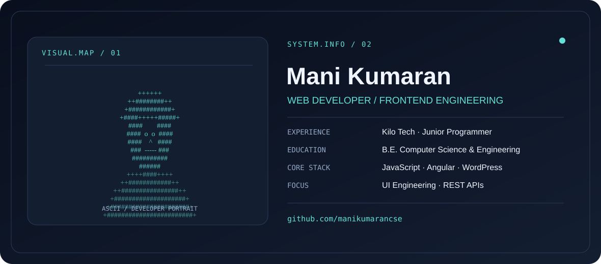

<picture>
  <source media="(prefers-color-scheme: dark)" srcset="./dark.svg" />
  <source media="(prefers-color-scheme: light)" srcset="./light.svg" />
  
</picture>

### Web Developer · Frontend Interfaces · API Integration

Building responsive, usable web experiences with attention to design, maintainability and performance.

[**Portfolio**](https://portfolio-7eb17.web.app/) · [**LinkedIn**](https://www.linkedin.com/in/mani-kumaran-04871a275) · [**Email**](mailto:manikumaran.dev@gmail.com)

## About me

I'm a web developer with experience building and maintaining responsive interfaces, integrating REST APIs and deploying websites. I enjoy turning design ideas into practical products, from lightweight JavaScript applications to WordPress websites.

- **Experience:** Junior Programmer, Kilo Tech (Jan 2024 – Feb 2026)
- **Education:** B.E., Computer Science & Engineering — MIET Engineering College (2019–2023)
- **Interests:** Frontend development, interface design, custom themes and reliable deployments
- **Languages:** English and Tamil

## Selected work

| Project | Highlights | Demo |
| :--- | :--- | :--- |
| **Guitar Training Haus** | Freelance website for a guitar teacher, built with a custom WordPress theme | [Visit site](http://guitartraininghaus.free.nf/) |
| **BottleBook** | Responsive bottle-tracking app with interactive add, delete and completion actions | [Live demo](https://bottlebook-91f09.web.app/) |
| **Task Management App** | Browser-based to-do application with localStorage persistence | [Live demo](https://manikumarancse.github.io/To-Do-App/) |
| **Cricket Score Tracker** | Interactive scoreboard for runs, wickets and overs using JavaScript | [Live demo](https://manikumarancse.github.io/Cricket-Score/) |

## Technical toolkit

| Focus | Technologies & tools |
| :--- | :--- |
| **Frontend** | HTML5, CSS3, SCSS, JavaScript, Bootstrap, Tailwind CSS, Materialize |
| **Frameworks** | Angular, AngularJS |
| **APIs & backend** | REST API integration, basic PHP |
| **Data** | MySQL, Oracle SQL fundamentals |
| **CMS & hosting** | WordPress, custom themes, GoDaddy, InfinityFree |
| **Workflow** | Git, VS Code, Postman, Figma, Canva |

## Professional experience

**Junior Programmer — Kilo Tech**  
*January 2024 – February 2026*

Developed and maintained responsive web interfaces, integrated REST APIs and basic PHP functionality, and improved code reuse and application performance.

## Get in touch

I'm open to discussing frontend development, web projects and collaborations.

**[Explore my portfolio](https://portfolio-7eb17.web.app/)** · **[Connect on LinkedIn](https://www.linkedin.com/in/mani-kumaran-04871a275)** · **[Send an email](mailto:manikumaran.dev@gmail.com)**

---

Designed with SVG · Dark and light theme support · No external banner assets

